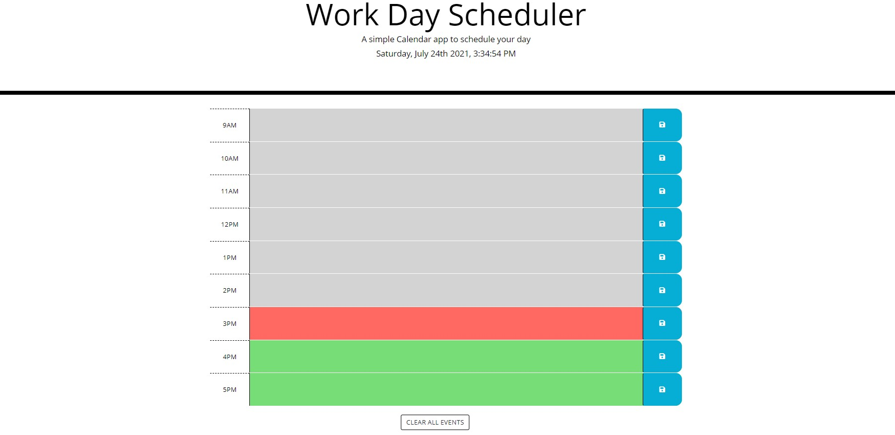

# Workday Planner

## Description
A simple workday scheduler that allows the user to save events for each hour of the day. The motivation behind creating this app was to make a scheduler to help plan your workday 

## Technology Used
The application uses HTML, CSS, Javascript, and Jquery and is updated regularly to indicate whether events are in the past, present, or future.

## Links
https://chloeyu17.github.io/workday-planner/

https://github.com/chloeyu17/workday-planner

## Usage
* The workday calendar displays work hours of the day from 9AM - 5PM.
* The workday calendar can have events inputted in hour blocks.  Event descriptions are saved to local storage.
* Time blocks are color coded to indicate whether they are in the past, present, or future.
* Events can be cleared using the clear button at the bottom of the page.

## Images

## Contributors
* Gabe Thomas (https://github.com/samohtebag)
* Jason Barbanel (https://github.com/Jbarbss)
* Patrick Walker (https://github.com/Pat31477)